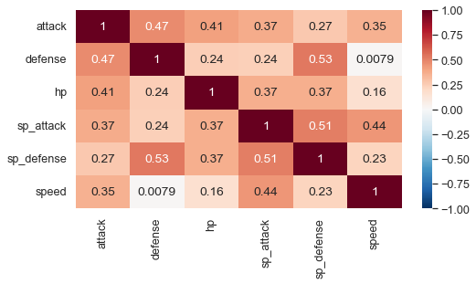

# Pokemon-Analysis

## Overview

The Pokemon franchise has introduced hundreds of pokemon since the release of their first video game in the 90s. This project analyzes pokemon data from the first 7 sets of games, or "generations" as they are more commonly referred to. In total, this is 801 pokemon being anayzed. 

The data is comprised of over 40 categories. This includes typical video games stats (such as attack, defense, etc.) but also variables less related to the mechanics of the game, such as heigh and weight. The table below summarizes the types of values in the dataset.

Once the analysis was complete, the cleaned and modified dataset was stored in a sql database for future reference. 

## Results

Pokemon stats tend to follow a normal distribution. For example, consider the histograms of base attack and base speed. 

Here is a pairplot and heatmap comparing all six pokemon stats to each other. There seems to be less of a correlation in stats among legendary pokemon. From the normal distributions, it is apparent that even the strongest legendaries for each stat have non-legendary competitors for that stat.

Here are some additional insights from the analysis:

* Dragon type pokemon are the overall strongest, on average. 2nd place goes to steel type. As expected, bug type are the weakest on average.
* There have been legendary pokemon with each type, with poison being the rarest.
* water and normal types are the most common type of pokemon, and ice is rarest
* As expected, flying and electric are the fastest on average. Rock is the slowest.
* Dragon and steel are heaviest, fiary is lightest
* dragons are tallest, fiary are smallest

The above observations are from the following tables: 

Lastly, pokemon were ranked for different stats. As some examples, here are the top ten attack pokemon and top ten pokemon overall.

## Conclusion

